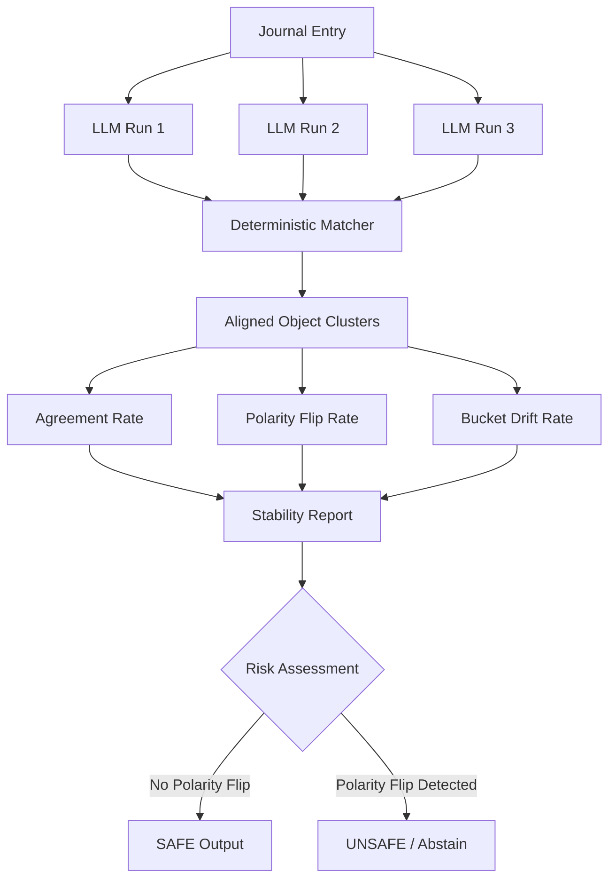

# -Run-to-Run-Variance-Stability-Analysis
Evaluated LLM reliability by detecting unsafe run-to-run variance using evidence-based stability metrics.

## Overview
LLM outputs are inherently non-deterministic — the same prompt can produce different results across runs.  
In safety-critical domains like women’s health, this variability must be **measured, controlled, and interpreted**, not ignored.

This project implements a **stability evaluation framework** to analyze how consistent and safe LLM outputs are across multiple runs **without relying on ground-truth labels**.

---

## What I Built
I designed and implemented a system that:
- Aligns semantic objects across 3 LLM runs per journal
- Measures run-to-run variance using quantitative stability metrics
- Flags **high-risk instability**, especially polarity flips
- Produces clear, auditable safety decisions per journal

---
## System Flow Diagram


---

## Key Design Decisions

### 1. Formal Definition of Stability
Two outputs are considered the *same* if they:
- Refer to the **same evidence span** in the journal (primary signal)
- Belong to the same semantic domain

Allowed to drift:
- Free-text phrasing
- Minor bucket changes (intensity / time)

Must remain stable:
- Evidence anchoring
- Polarity (present ↔ absent)

---

### 2. Deterministic Matching Algorithm
- Primary matching: **evidence span overlap**
- Domain consistency enforced
- Deterministic and audit-friendly by design

---

### 3. Stability Metrics Implemented
For each journal:
- **Agreement Rate** – how consistently objects appear across runs
- **Polarity Flip Rate** – high-risk signal (any non-zero value is unsafe)
- **Bucket Drift Rate** – measures intensity/time instability

---

### 4. Risk Framing & Safety Logic
- Any polarity flip → **UNSAFE**
- Unsafe journals are flagged and downstream actions should be blocked
- This reflects conservative, safety-first design suitable for health systems

---

## Output
The system produces:
- A clean, human-readable per-journal stability report
- Explicit safety decisions (`SAFE` / `UNSAFE`)
- Risk flags for auditability

---

## Why This Matters
This project demonstrates how non-deterministic LLM outputs can be:
- Evaluated without labels
- Interpreted safely
- Integrated into production systems with clear guardrails

It focuses on **systems thinking, safety awareness, and practical ML judgment**, not just model performance.

---

## How to Run
```bash
python src/main.py
